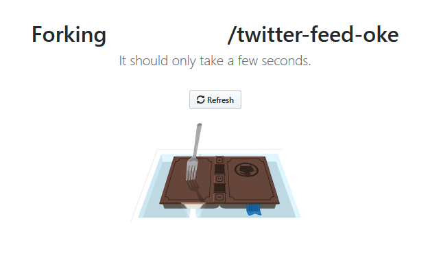


## Lab 100 - Microservice를 개발

서비스를 개발하여 소스관리툴에 반영하는 것을 가정하여 여기서는 이미 개발된 소스를 각자의 GitHub 계정으로 복제합니다.

### **STEP 1**: GitHub에서 예제(자바) 애플리케이션 포크하기

1. 브라우저에서 아래 링크로 이동:

    [https://github.com/DannyKang/twitter-feed-oke](https://github.com/DannyKang/twitter-feed-oke)

2. 오른쪽 상단의 **Fork** 를 클릭하고 GitHub 계정으로 로그인합니다. 
  
  
3. 오른쪽 상단의 **Fork** 를 한번 더 클릭하고 자신의 GitHub으로 Fork 합니다. 
    