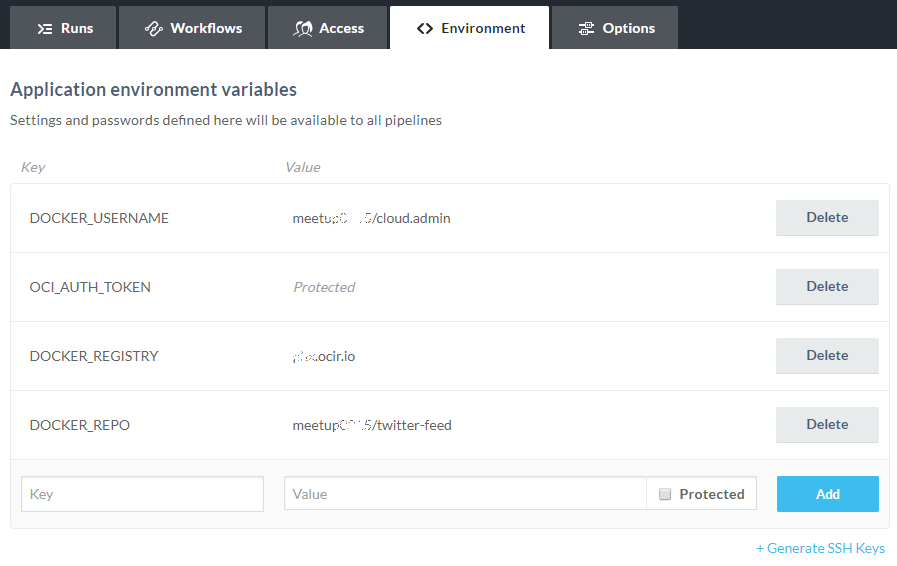
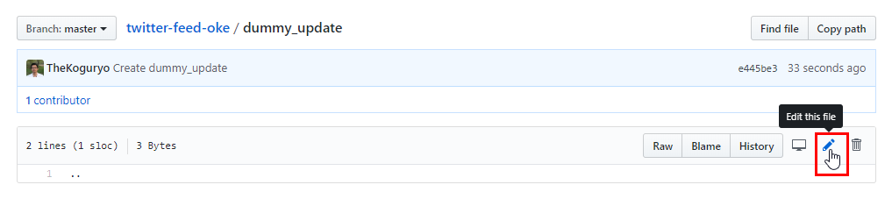

## Lab 200 - Wercker를 통한 빌드 자동화 - Image 생성 및 OCI Registry에 Image 등록
소스 변경으로 인해 Git에 Commit이 발생하면 빌드되는 과정으로 Docker Image 생성 및 OCI Registry에  등록하는 과정을 실습합니다


### **STEP 1**: Git 소스에 wercker.yml 파일 만들기

wercker.yml 파일은 Wercker를 사용하기 위해 필요한 설정 파일로 Wercker에서 소스 애플리케이션을 빌드, 배포하는 과정에서 필요한 모든 step 들을 정의합니다.

1. GitHub으로 접속하여, **twitter-feed** 레포지토리에서 **Create new file** 클릭<br>
  

2. 파일이름(Name your file...) 에 `wercker.yml` 입력<br>
  

3. **Edit new file** 탭 아래 파일 내용에 다음 내용을 **붙여넣기**합니다.<br>
    ```yaml
    #Use OpenJDK base docker image from dockerhub and open the application port on the docker container
    box:
      id: openjdk:8
      ports:
        - 8080

    #Build our application using Maven, just as we always have
    build:
      steps:
        - install-packages:
            packages: maven
        - script:
            name: maven build
            code: mvn clean assembly:assembly
    ```

4. 에디터 창에 아래와 같은 YAML 파일을 볼 수 있습니다.<br>
  

5. wercker.yml 설명
    * box:
        - box Pipeline은 필수 Pipeline으로 Wercker가 실행할 docker base image를 정의
    * build:
        - build Pipeline은 Wercker에서 Workflow 생성시 시작 Pipeline으로 소스 빌드관련 Step을 정의합니다.
        - 복제한 Java 애플리케이션 maven 빌드를 사용하기 때문에 필요한 패키지 설치 및 실행 스크립트를 순서대로 정의했습니다. 소스의 빌드 방식에 맞춰 변경하면 됩니다.

6. 화면의 제일 밑에 **Commit new file** 버튼을 클릭하여 파일 추가를 완료합니다.<br>
  


### **STEP 2**: Wercker 애플리케이션 생성

1. Wercker 애플리케이션을 처음 만드는 경우는 첫화면의 **Create your first application** 버튼을 클릭하고,<br>
이미 생성 경험이 있는 경우는 오른쪽 위의 **+** 아이콘을 클릭한 뒤 **Add application**를 클릭한다.<br>
  


2. 소스코드를 가져올 대상을 **GitHub**으로 설정하고 **Next** 클릭<br>
  

3. 자신의 GitHub Repository 중에서 **twitter-feed-oke** 을 선택하고 **Next** 클릭<br>
  

4. default (without using SSH key)을 클릭하고 **Next** 클릭<br>
  

5. 생성정화 확인 후 **Create** 클릭<br>
  


### **STEP 3**: Workflow 확인

1. 새로 생성된 애플리케이션의 **Runs** 탭으로 이동, 이 Runs 탭에서는 애플리케이션의 실행 이력을 볼 수 있다. 아직은 실행된 이력이 없습니다.

2. **Workflows** 탭을 이동합니다. 워크플로우는 Git commit에 의해 기동(trigger)되며, 현재는 기본 생성된 **build** 만이 Pipeline에 등록되어 있고 실행시 처음 시작되도록 Workflow의 제일 처음에 있습니다.<br>
  

3. 다시 **Runs** 탭으로 이동하여 화면 아래쪽에 있는 **I already have a wercker.yml, trigger a build now.** 를 클릭하여 Workflow를 실행해 봅니다.<br>
  

4. 앞서 만든 wercker.yml 파일 내용을 기준으로 실행되는 것을 확인할 수 있습니다.<br>
  


### **STEP 4**: wercker.yml 업데이트 - Push Image 추가하기

1. Github 화면에서 **wercker.yml** 파일을 클릭하고, 수정하기 위해 **연필모양 아이콘**  클릭.<br>
  

2. 아래 내용을 복사해서 wercker.yml 아래쪽에 **붙여넣기** 추가한다.
  ```yaml
  #Push the docker image with our built and tested application to the Oracle Container Registry
  push-image:
    steps:
      - internal/docker-push:
          username: $DOCKER_USERNAME
          password: $OCI_AUTH_TOKEN
          repository: $DOCKER_REGISTRY/$DOCKER_REPO
          registry: https://$DOCKER_REGISTRY/v2
          tag: $WERCKER_GIT_BRANCH-$WERCKER_GIT_COMMIT
          working-dir: /pipeline/source
          ports: 8080
          cmd: sh target/bin/start
  ```
  

3. 이 섹션에서는 두 번째 파이프라인인 **push-image** 에서 실행할 내용을 정의한다. **internal/docker-push** 스텝은 빌드한 Docker Image를 Docker Registry에 저장하는 스텝이다. 자세한 사항은 다음 참조 (http://devcenter.wercker.com/docs/steps/internal-steps#docker-push).<br>

4. 페이지 제일 밑에 **Commit changes** 클릭하여 저장<br>
  


### **STEP 5**: Wercker 워크플로우에 push-image 파이프라인 추가

1. Wercker로 이동하여 앞서 생성한 애플리케이션의 **Workflow** 탭으로 이동합니다.<br>

2. 아래 **Add new pipeline** 버튼 클릭<br>
  

3. 파이프라인 Name과 YML Pipeline name 항목에 `push-image`를 입력하고 **Create** 클릭<br>
  

4. 일단은, 생성된 파이프라인의 환경변수를 입력하는 항목은 비워 둡니다. **Workflows** 탭을 다시 클릭해서 Workflow Editor 창으로 이동<br>
  

5. **+** 기호를 클릭.<br>
  

6. **Execute Pipeline** 항목에 좀전에 생성한 **push-image** 를 선택하고 **Add** 클릭.<br>
  

7. 이제 워크플로우는 그림과 같이 build 후 push-image가 실행되게 됩니다.<br>
   


### **STEP 6**: Wercker에 환경 변수 설정

- 빌드한 Docker Image를 Registry에 등록하기 위해서는 접속정보가 필요합니다. Registry에 별로 약간의 차이는 있지만, internal/docker-push step으로 OCI Registry로 등록하기 위해서는 다음 정보들이 필요합니다.
  ```
  username: $OCI_USERNAME
  password: $OCI_AUTH_TOKEN
  repository: $OCI_REPOSITORY_NAME
  registry: $OCI_REGISTRY_URL
  ```
    * Regitry 종류별 가이드는 다음 링크를 참고하세요.<br>
    [Wercker Documentation > Pushing Images](https://devcenter.wercker.com/administration/containers/pushing-images/)

- 환경변수는 각각 OCI 다음 정보를 사용합니다.<br>

| Key                 | Value                                                                  |
|---------------------|------------------------------------------------------------------------|
| OCI_USERNAME        | \<tenancy_name\>/\<username\> <br>IDCS 유저인 경우는 \<tenancy-name\>/oracleidentitycloudservice/\<username\> |
| OCI_AUTH_TOKEN      | {user의 AUTH_TOKEN}
| OCI_REPOSITORY_NAME | \<tenancy_name\>/{원하는 repository name} |
| OCI_REGISTRY_URL    | https://\<region-code\>.ocir.io/v2/ <br> region-code는 fra, iad, lhr 또는 phx |


1. Wercker로 이동하여 워크플로우에서 사용하는 환경변수를 맞는 접속정보를 설정해야 합니다. Wercker로 이동하여 애플리케이션의 Enviroment 탭으로 이동합니다.
   

2. 환경변수를 Key, Value 형태로 순서대로 하나씩 등록합니다. AUTH_TOKEN은 보안을 위해 Value 입력시 **Protected**를 체크합니다.
   


### **STEP 7**: 테스트

1. Git 소스에서 변경사항을 발생시키기 위해 **dummy_update** 파일을 클릭하고, 수정하기 위해 **연필모양 아이콘**  클릭.<br>
  

2. 아래 내용을 추가로 입력합니다.<br>
  

3. 페이지 제일 밑에 **Commit changes** 클릭하여 저장<br>
  

4. Wercker 화면으로 가서 이동합니다. 워크플로우는 Git commit에 의해 기동(trigger)된 것을 확인 할 수 있습니다.
  

5. OCI Registry를 확인하기 위해 OCI Console에 로그인합니다.
  

6. OCI Registry로 이동합니다.  
  

7. 그림과 같이 Repository에 이미지가 등록된 것을 확인 할 수 있습니다.  
  

8. 우측 Actions > Copy Pull Command에서 docker pull 구문을 복사할 수 있습니다.