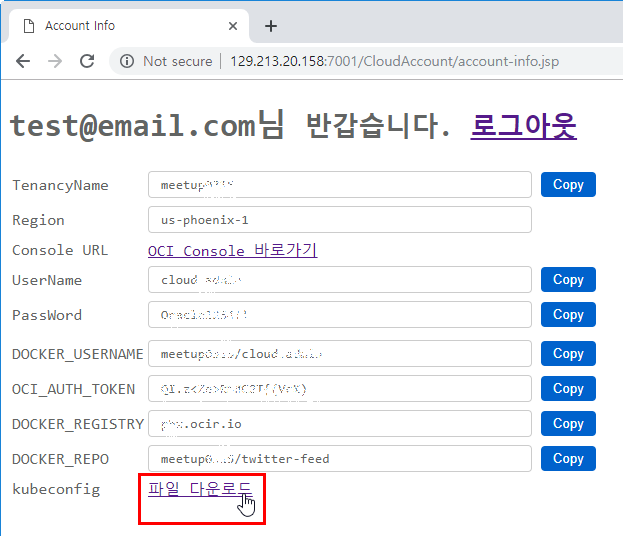


## Lab 300 - Kubernetes 환경 설정: 옵션 #1. 구성된 환경 사용 & 로컬 kubectl 환경만 구성하기
사용할 Kubernetes를 OCI 환경의 Kubernetes 클러스터를 구성하고 클라이언트에서 kubectl로 작업하기 위해서는 환경 설정 작업이 필요합니다. 이 부분에 대해서 실습합니다.<br>


### **STEP 1~5**: 과정 생략
**실습 편의성을 위해 이미 환경을 구성해 놓았지만, 직접 해보기를 원하시는 분은 [Lab300-2](Lab300-2.md)을 따라해 보시기 바랍니다.**

### **STEP 5**: OKE 시작하기

### **STEP 5-1**: kubeconfig 파일 다운로드
kubectl로 OKE 클러스터에 접근하기 위해 설정파일인 kubeconfig 파일이 필요합니다.<br>
이미 만들어 놓은 개인별 파일을 다운 받아 원하시는 위치에 파일로 확장자 없이 저장합니다. 예) F:\meetup\kubeconfig
  

### **STEP 5-2**: 클라이트 환경에 kubectl 설치 및 테스트
다음 문서를 참고하여 kubectl을 설치합니다.<br>
https://kubernetes.io/docs/tasks/tools/install-kubectl/#install-kubectl

- 윈도우 예시
```
F:\meetup>curl -LO https://storage.googleapis.com/kubernetes-release/release/v1.13.0/bin/windows/amd64/kubectl.exe
  % Total    % Received % Xferd  Average Speed   Time    Time     Time  Current
                                 Dload  Upload   Total   Spent    Left  Speed
100 37.8M  100 37.8M    0     0  4301k      0  0:00:09  0:00:09 --:--:-- 6480k

F:\meetup>dir
 F 드라이브의 볼륨: Stage
 볼륨 일련 번호: 785E-1501

 F:\meetup 디렉터리

2019-03-14  오후 03:53    <DIR>          .
2019-03-14  오후 03:53    <DIR>          ..
2019-03-14  오후 03:45             3,651 kubeconfig
2019-03-14  오후 03:54        39,644,160 kubectl.exe
               2개 파일          39,647,811 바이트
               2개 디렉터리  30,444,306,432 바이트 남음

F:\meetup>.\kubectl.exe version
Client Version: version.Info{Major:"1", Minor:"13", GitVersion:"v1.13.0", GitCommit:"ddf47ac13c1a9483ea035a79cd7c10005ff21a6d", GitTreeState:"clean", BuildDate:"2018-12-03T21:04:45Z", GoVersion:"go1.11.2", Compiler:"gc", Platform:"windows/amd64"}
Unable to connect to the server: dial tcp [::1]:8080: connectex: No connection could be made because the target machine actively refused it.

F:\meetup>set KUBECONFIG=F:\meetup\kubeconfig

F:\meetup>echo %KUBECONFIG%
F:\meetup\kubeconfig

F:\meetup>kubectl cluster-info
Kubernetes master is running at https://c3damrymfrw.us-phoenix-1.clusters.oci.oraclecloud.com:6443
KubeDNS is running at https://c3damrymfrw.us-phoenix-1.clusters.oci.oraclecloud.com:6443/api/v1/namespaces/kube-system/services/kube-dns:dns/proxy

To further debug and diagnose cluster problems, use 'kubectl cluster-info dump'.

F:\meetup>
```

### **STEP 5-3**: 애플리케이션 배포 예시
실제 애플리케이션 배포는 다음 실습에서 진행하겠습니다. 아래는 **Getting Started**의 예시입니다.<br>
아래와 같이 yaml 파일을 통해 배포 할 수 있습니다.<br>
이후 과정에서 Wercker 툴에서 배포하는 방법을 살펴보겠습니다.

  - 윈도우 예시
```
F:\meetup>set KUBECONFIG=F:\meetup\kubeconfig

F:\meetup>echo %KUBECONFIG%
F:\meetup\kubeconfig

F:\meetup>.\kubectl create -f https://k8s.io/docs/tasks/run-application/deployment.yaml
deployment.apps/nginx-deployment created

F:\meetup>
```
