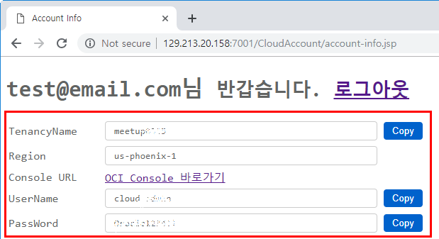
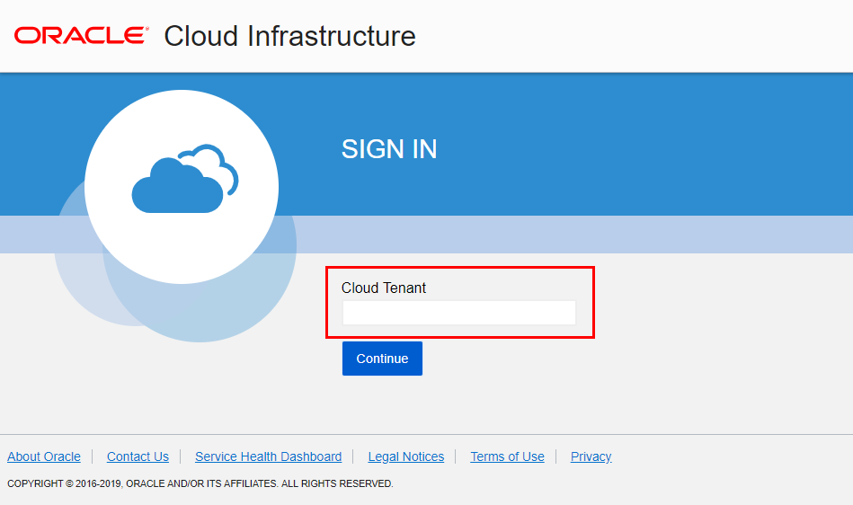
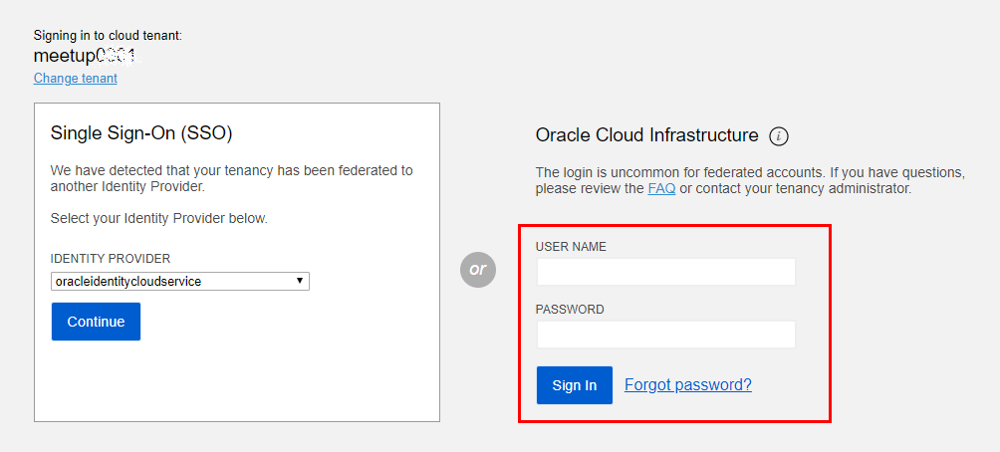

## Lab 300 - Kubernetes 환경 설정: 옵션 #2. 모든 과정 직접 해보기 
사용할 Kubernetes를 OCI 환경의 Kubernetes 클러스터를 구성하고 클라이언트에서 kubectl로 작업하기 위해서는 환경 설정 작업이 필요합니다. 이 부분에 대해서 실습합니다.<br>
**실습 편의성을 위해 이미 환경을 구성해 놓았지만, 직접 해보기를 원하시는 분은 따라해 보시기 바랍니다.**


### **STEP 1**: OCI 콘솔 로그인

**각자의 OCI Console URL 및 접속 사용자는 Cloud Account을 참고합니다.**

1. OCI Console에 로그인합니다.
    - 개인별 **Oracle Cloud 접속 정보** 사용
    
    - TenancyName 입력
    
    - Username/Password 입력
      

2. 아래 화면이 나오면 접속할 Tenant 이름을 입력합니다.<br>
  

3. 싱글사인온 유저가 아닌 오른쪽 OCI 직접 로그인을 통해 로그인합니다.<br>
    


### **STEP 2**: OKE 사용권한 설정
OKE가 나의 자원을 사용할 수 있게 권한 설정이 필요합니다.

1. 왼쪽 위의 내비게이션 메뉴를 클릭합니다.<br>
    

2. Identity > Policies 로 이동합니다.<br>  
    

3. **Create Policy** 클릭<br>  
    

4. **OKEPolicy** 란 이름의 새 Policy를 생성합니다.<br> 
    - 설정 정책: **`allow service OKE to manage all-resources in tenancy`**
            


### **STEP 3**: Kubernetes 전용 Compartment 생성
Compartment는 OCI Tenant 내에서 자원들을 별도로 관리하기 위한 폴더라고 생각하시면 됩니다. Group별로 Compartment에 권한을 별도로 분리할 수 있는 OCI의 고유한 기능입니다. Root Compartment에 모든 작업을 해도 되지만, 분리가 필요할 경우 사용할 수 있습니다.

1. 왼쪽 위의 내비게이션 메뉴를 클릭합니다.<br>

2. Identity > Compartments 로 이동합니다.<br>
    

3. **Create Compartment** 클릭<br>
    

4. **OKEComp** 란 이름의 새 Compartment를 생성합니다.<br> 
    


### **STEP 4**: Kubernentes Cluster 만들기
1. 왼쪽 위의 내비게이션 메뉴를 클릭합니다.<br>

2. Developer Services > Container Clusters(OKE) 로 이동합니다.<br>
    

3. 대상 COMPARMENT를 선택하고 **Create Cluster** 클릭<br>
    

4. 만들 클러스터의 이름을 입력하고 빠른 생성을 위해 **QUICK CREATE**를 선택하고 **CREATE** 클릭<br> 
  **QUICK CREATE**는 OKE 클러스터가 사용할 네트워크 구성까지 한번에 만들어 지며, CUSTOM하게 네트워크 등을 구성하려면 **CUSTOM CREATE** 를 사용하면 됩니다.<br>
    
  

5. 생성완료될때까지 약간의 시간이 걸립니다. 생성이 완료되면 Node Pool의 모든 Node가 Active 상태가 됩니다.<br>
  .

### **STEP 5**: OKE 시작하기
OKE Cluster에 애플리케이션을 배포하는 것은 생성한 클러스터 하단 **Getting Started**에 보이는 것처럼 3단계를 거치게 됩니다.<br>
  

### **STEP 5-1**: kubeconfig 파일 다운로드
kubectl로 OKE 클러스터에 접근하기 위해 설정파일인 kubeconfig 파일이 필요합니다.<br>
**OKE 클러스터의 kubeconfig 파일 생성은 OCI CLI를 통해서만 가능합니다.**

1. 다음 링크를 참조하여 각자 노트북에 OCI를 설치합니다.<br>
  [OCI CLI 설치하기](https://thekoguryo.github.io/oci/chapter14/1/)

2. **Getting Started**의 1번 단계인 **Access Kubeconfig**을 클릭하여 복사한 OCI CLI 명령을 수행하여 kubeconfig 파일을 생성합니다.<br>
  

    - 예시
        * kubernetes cluster의 id는 OCI Console에서 앞서 생성한 cluster를 클릭하면 cluster ocid를 확인 할 수 있습니다.
```
F:\meetup>oci ce cluster create-kubeconfig --cluster-id ocid1.cluster.oc1.iad.aaaaaaaaafrtczbthfswcyzumu2donbvgmytamrvmnrtezlghcsdmyjvmmyt --file kubeconfig --region us-ashburn-1

F:\meetup>dir
 F 드라이브의 볼륨: Stage
 볼륨 일련 번호: 785E-1501

 F:\meetup 디렉터리

2019-03-14  오후 03:45    <DIR>          .
2019-03-14  오후 03:45    <DIR>          ..
2019-03-14  오후 03:45             3,651 kubeconfig
               1개 파일               3,651 바이트
               2개 디렉터리  30,483,951,616 바이트 남음

F:\meetup>
```

### **STEP 5-2**: 클라이트 환경에 kubectl 설치 및 테스트
다음 문서를 참고하여 kubectl을 설치합니다.<br>
https://kubernetes.io/docs/tasks/tools/install-kubectl/#install-kubectl

- 윈도우 예시
```
F:\meetup>curl -LO https://storage.googleapis.com/kubernetes-release/release/v1.13.0/bin/windows/amd64/kubectl.exe
  % Total    % Received % Xferd  Average Speed   Time    Time     Time  Current
                                 Dload  Upload   Total   Spent    Left  Speed
100 37.8M  100 37.8M    0     0  4301k      0  0:00:09  0:00:09 --:--:-- 6480k

F:\meetup>dir
 F 드라이브의 볼륨: Stage
 볼륨 일련 번호: 785E-1501

 F:\meetup 디렉터리

2019-03-14  오후 03:53    <DIR>          .
2019-03-14  오후 03:53    <DIR>          ..
2019-03-14  오후 03:45             3,651 kubeconfig
2019-03-14  오후 03:54        39,644,160 kubectl.exe
               2개 파일          39,647,811 바이트
               2개 디렉터리  30,444,306,432 바이트 남음

F:\meetup>.\kubectl.exe version
Client Version: version.Info{Major:"1", Minor:"13", GitVersion:"v1.13.0", GitCommit:"ddf47ac13c1a9483ea035a79cd7c10005ff21a6d", GitTreeState:"clean", BuildDate:"2018-12-03T21:04:45Z", GoVersion:"go1.11.2", Compiler:"gc", Platform:"windows/amd64"}
Unable to connect to the server: dial tcp [::1]:8080: connectex: No connection could be made because the target machine actively refused it.

F:\meetup>set KUBECONFIG=F:\meetup\kubeconfig

F:\meetup>echo %KUBECONFIG%
F:\meetup\kubeconfig

F:\meetup>kubectl cluster-info
Kubernetes master is running at https://c3damrymfrw.us-phoenix-1.clusters.oci.oraclecloud.com:6443
KubeDNS is running at https://c3damrymfrw.us-phoenix-1.clusters.oci.oraclecloud.com:6443/api/v1/namespaces/kube-system/services/kube-dns:dns/proxy

To further debug and diagnose cluster problems, use 'kubectl cluster-info dump'.

F:\meetup>
```

### **STEP 5-3**: 애플리케이션 배포 예시
실제 애플리케이션 배포는 다음 실습에서 진행하겠습니다. 아래는 **Getting Started**의 예시입니다.

  - 윈도우 예시
```
F:\meetup>set KUBECONFIG=F:\meetup\kubeconfig

F:\meetup>echo %KUBECONFIG%
F:\meetup\kubeconfig

F:\meetup>.\kubectl create -f https://k8s.io/docs/tasks/run-application/deployment.yaml
deployment.apps/nginx-deployment created

F:\meetup>
```

### **STEP 5-4**: Kubernetes Dashboard 접속
1. **Getting Started**에서처럼 다음명령을 통해 대시보드에 접속할 수 있습니다.
```
kubectl proxy
Dashboard will be available at:
http://localhost:8001/api/v1/namespaces/kube-system/services/https:kubernetes-dashboard:/proxy/
```

#### 윈도우 예시
1. 다음 명령 실행
```
F:\meetup>kubectl proxy
Starting to serve on 127.0.0.1:8001

```

2. 브라우저로 접속<br>
http://localhost:8001/api/v1/namespaces/kube-system/services/https:kubernetes-dashboard:/proxy/

3. 앞서 생성한 kubeconfig 파일 선택후 접속
  

4. kubenetes dashboard로 배포된 애플리케이션을 모니터링 할 수 있습니다.  
  