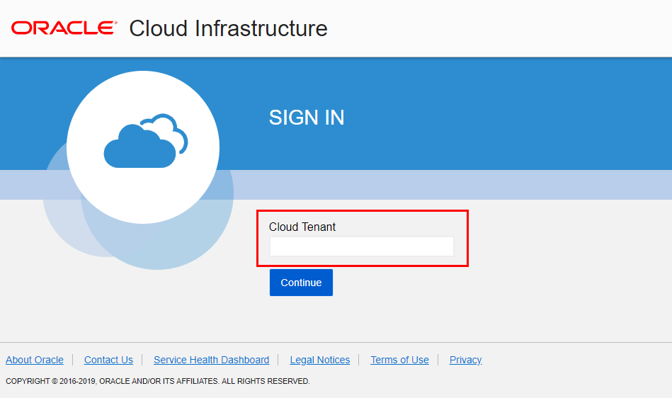
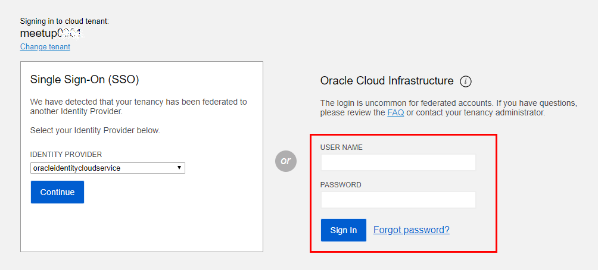


## Lab 300 - Kubernetes 환경 설정
사용할 Kubernetes를 OCI 환경의 Kubernetes 클러스터를 구성하고 클라이언트에서 kubectl로 작업하기 위해서는 환경 설정 작업이 필요합니다. 이 부분에 대해서 실습합니다. 
**실습 편의성을 위해 이미 환경을 구성해 놓았지만, 직접 해보기를 원하시는 분은 따라해 보시기 바랍니다.**

### **STEP 1**: OCI 콘솔 로그인

**각자의 OCI Console URL 및 접속 사용자는 Cloud Account을 참고합니다.**

1. 다음 URL을 통해 OCI Console로 바로 접속합니다. 
  https://console.{region_name}.oraclecloud.com/

2. 아래 화면이 나오면 접속할 Tenant 이름을 입력합니다.
  

3. SSO가 아닌 오른쪽 OCI 직접 로그인을 통해 로그인합니다.
    

### **STEP 2**: Kubernetes 전용 Compartment 생성

### **STEP 3**: OKE 사용권한 설정

### **STEP 4**: Kubernentes Cluster 만들기

### **STEP 5**: OCI CLI로 kubeconfig 파일 다운로드

### **STEP 6**: 클라이트 환경에 kubectl 설치 및 테스트
